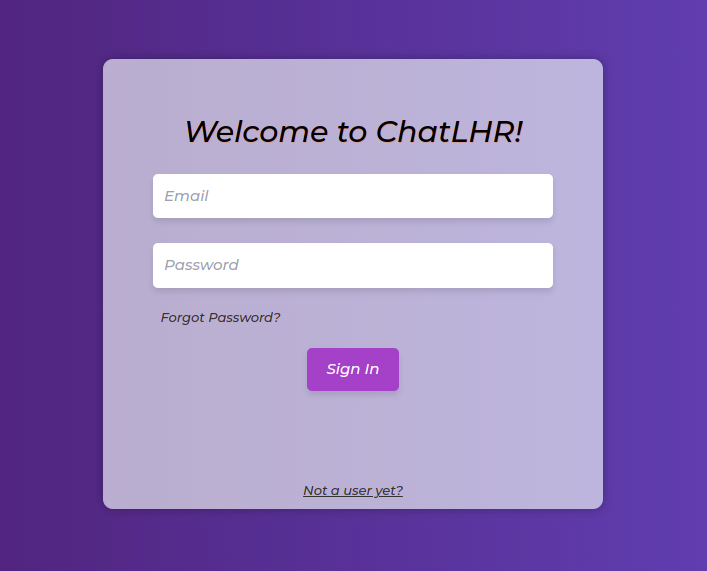
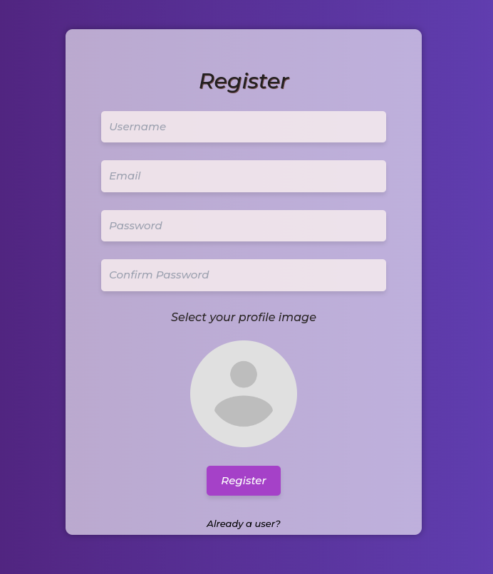
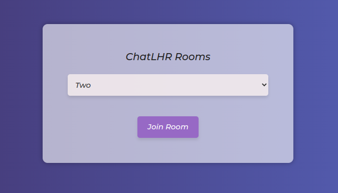

# ChatLHR

Team: Hizkiel Mesfin, Lesley-Ann Christl & Rami Basheer

---

## Description

This is our version of a live chat app. Users can send and receive messages in real-time. It includes a registration page, log in page, join room page, forgot password page, password change and live chat room. Registration sends a verification email and you are able to change your password upon request through email.

---

---

## Installation Instructions

- clone repository

### Client Folder

- npm install
- npm start

### Server Folder

- npm install
- npm start
  - or
- npm run dev

---

---

## Technologies Used

- React
- JavaScript
- React Icons
- CSS
- Node JS
- Express
- MongoDB
- Axios
- Mongoose
- Socket.io
- CORS
- Bcrypt
- JWT
- Cloudinary
- Nodemailer
- Elastic Email SMTP
- Concurrently
- react-input-emoji

---

---

## Contributors

- [@ezekielbuzzi
  ](https://github.com/ezekielbuzzi)
- [@LalaChristl
  ](https://github.com/LalaChristl)
- [@Rami666
  ](https://github.com/Rami666)

---

## More about us

We are a group of students persuing our certificate for Full-Stack Web Development. This is a project incorporating Node, React and Socket.io as well as using Cloudinary and SMTP. We hope you enjoy our app!
